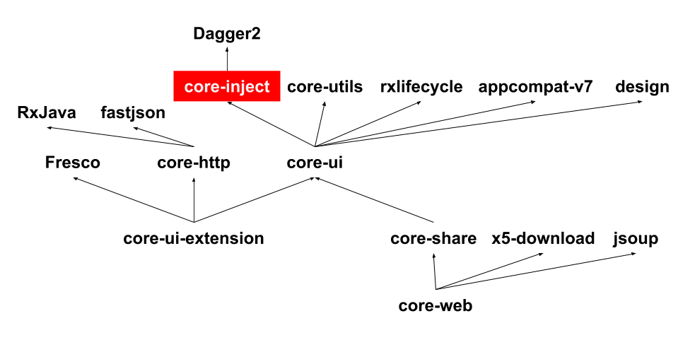

# core-inject

Dagger2依赖注入，应用在MVP架构中用来解耦。

### 外部引用

```
compile 'com.joy.support:core-inject:1.0.2'
```

### 自身依赖

```
compile 'com.google.dagger:dagger:2.4'
apt 'com.google.dagger:dagger-compiler:2.4'
provided 'org.glassfish:javax.annotation:10.0-b28'
```

### 结构

- **Component**

    `ActivityComponent`

    `AppComponent`

- **Module**

    `ActivityModule`

    `AppModule`

- **Scope**

    `ActivityScope`

    `AppScope`

### 用法

见core-web模块

### Joy-Library中的引用体系


